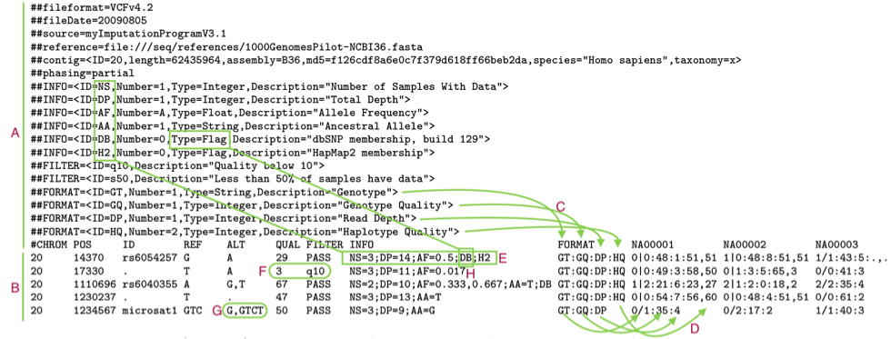
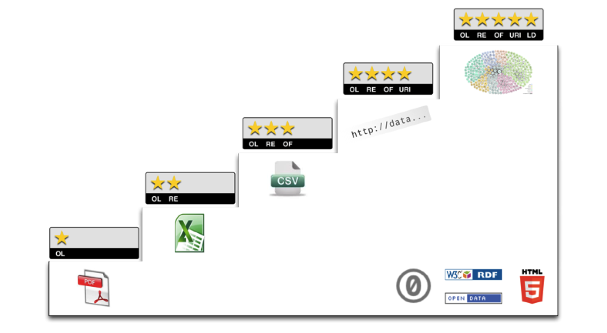
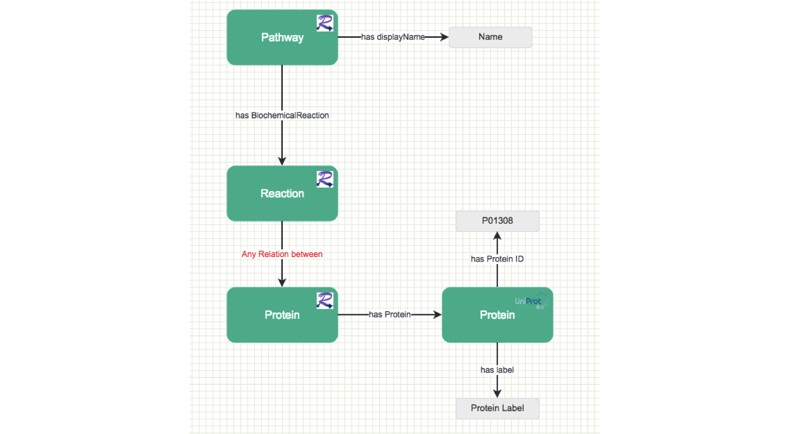

Introdução
==========


DNA
===

- Dna, genótipo, fenótipo
- Saúde e doença
- Cada dia mais barato
   - Por que não sequenciar?


Processamento
=============

- Série de passos
- VCF (variant call format) como produto final
  - Variações encontradas para uma ou mais amostras
- Anotações


Vídeo da Ilumina mostrando como se dá o sequenciamento


VCF
===


Exemplo de VCF


```
##FORMAT=<ID=GT, Number=1, Type=String, Description=”Genotype”>
##FORMAT=<ID=GQ, Number=1, Type=Integer, Description=”Genotype Quality”>
##FORMAT=<ID=DP, Number=1, Type=Interger, Description=”Read Depth”
```
| Campo	| ID	| Number	| Type	| Description |
|------:|:--:|:--------:|:-----:|:------------|
| Format	| GT | 1	| String | Genotype |
| Format	| GQ |	1	| Integer	| Genotype Quality |
| Format	| DP	| 1	| Integer	| Read Depth |
```
##contig=<ID=20,length=62435964,assembly=B36,
md5=f126cdf8a6e0c7f379d618ff66beb2da,
species="Homo sapiens",taxonomy=x>
```
| Campo |	ID	| length |	assembly |	md5 |	species |	taxonomy |
|------:|:---:|:------:|:---------:|:----:|:-------:|:---------|
| Contig | 20	| 62435964 |	B36 |	f126cdf  8a6e0c7f  379d618ff  66beb2da |	Homo Sapiens |	x |
Fonte: http://samtools.github.io/hts-specs/VCFv4.2.pdf


Dados externos
==============

- Uniprot
- Uniprot Knowledge Base
  - Swissprot – anotações manuais
  - TrEMBL - anotações automáticas
- EBI/NCBI


Linked Data
===========

- Dados estruturados
- Interligados
  - Não necessariamente por indices e chaves
- Consultas Semânticas


Open Linked Data
================


Figura 1. As cinco estrelas do open data


5 estrelas de Tim Benners-Lee
=============================

★ make your stuff available on the Web (whatever format) under an open license


★★ make it available as structured data (e.g., Excel instead of image scan of a table)


★★★ use non-proprietary formats (e.g., CSV instead of Excel)


★★★★ use URIs to denote things, so that people can point at your stuff


★★★★★ link your data to other data to provide context


RDF
===

- Resource Description Framework
- Padrão para modelagem de dados para web semântica
- Definido pela W3C
- Triplas e comunicão verbal
  - Sujeito, verbo, objeto
- Uso de URI – Uniform Resource Identifier


Formatos para RDF

XML
=======================
```
<rdf:RDF
xmlns:rdf="http://www.w3.org/1999/02/22-rdf-syntax-ns#"
xmlns:dc="http://purl.org/dc/elements/1.1/">
  <rdf:Description rdf:about="http://en.wikipedia.org/wiki/Tony_Benn">
    <dc:title>Tony Benn</dc:title>
    <dc:publisher>Wikipedia<dc:publisher>
  </rdf:Description>
</rdf:RDF>
```


Formatos para RDF

N3
======================
```
@prefix dc:<http://purl.org/dc/elements/1.1/>.
<http://en.wikipedia.org/wiki/Tony_Benn>
dc:title "Tony Benn";
dc:publisher "Wikipedia".
```

### Notes:

Verificar se a notação para N3 é essa mesmo. estou achando muito simples


Formatos para RDF

Turtle
==========================

```{xml}
@prefix rdf: <http://www.w3.org/1999/02/22-rdf-syntax-ns#> .
@prefix dc: <http://purl.org/dc/elements/1.1/> .
@prefix ex: <http://example.org/stuff/1.0/> .
<http://www.w3.org/TR/rdf-syntax-grammar>
dc:title "RDF/XML Syntax Specification (Revised)" ;
ex:editor [
  ex:fullname "Dave Beckett";
  ex:homePage <http://purl.org/net/dajobe/>
] .
```


Formatos para RDF

N-triples
=============================
```{xml}
<http://www.w3.org/TR/rdf-syntax-grammar>
<http://purl.org/dc/elements/1.1/title>
"RDF/XML Syntax Specification (Revised)" .

<http://www.w3.org/TR/rdf-syntax-grammar>
<http://example.org/stuff/1.0/editor>
_:bnode .

_:bnode
<http://example.org/stuff/1.0/fullname>
"Dave Beckett" .

_:bnode
<http://example.org/stuff/1.0/homePage>
<http://purl.org/net/dajobe/> .
```


SPARQL
======

###### Juju, o gato assustado, subiu ao telhado
________________________________________
Juju é um gato

Juju é assustado

Juju subiu ao telhado

O gato subiu ao telhado (tripla inferida?)
__________________________________________
```
SELECT ?para WHERE {:gato :subiu ?para}
SELECT ?quem WHERE {?quem :subiu :telhado}
SELECT ?oque WHERE {:gato ?oque :telhado}
SELECT * WHERE {:juju a []}

```


Sparqlgraph
===========


Figura 2. Screenshot da parte da interface do sparqlgraph
