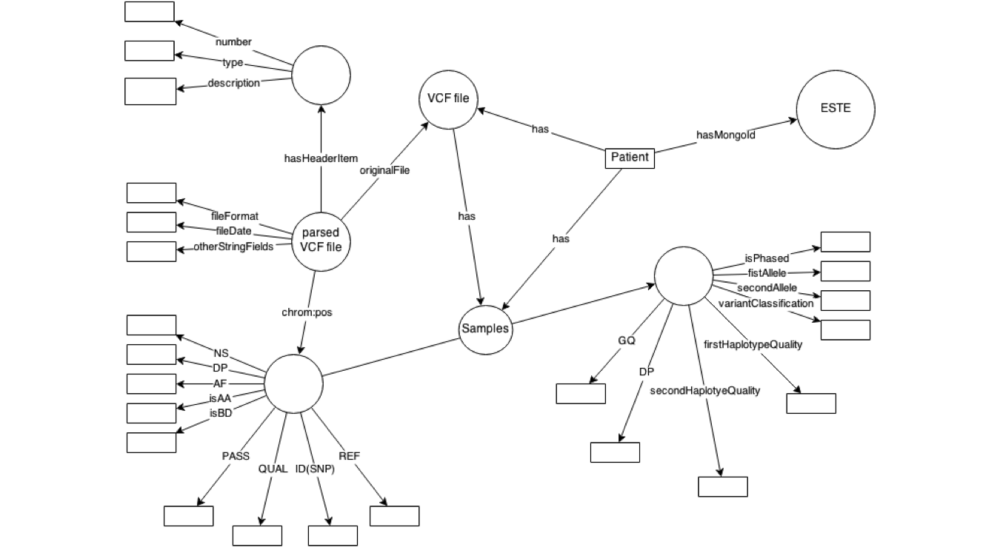

**Resultados**
==============

Mapa Isomorfico
===============

Figura com mapa

### Notes:

Substituir figura, usar algo em d3.js

URIs
====

- [URI definidas usando github pages](http://diegopenhanut.github.io/vcf-resources/v4_2/)

- Python script é usado para gerar as páginas e estrutura de diretórios

  -   <https://github.com/diegopenhanut/vcf-resources/blob/gh-pages/v4_2/createPages.py>
  - <https://github.com/diegopenhanut/vcf-resources/blob/gh-pages/v4_2/structure.csv>

Publicações vinculadas
======================

Poster
======

- PATHOLOGY TRAINEE RESEARCH DAY, UAB

  - ISOMORPHIC SEMANTIC MAPPING OF GENOMIC VARIATION CALLING FORMAT

Manuscript
==========

- VCFR
  - sobre o modelo de dados em si.
  - Isomorphic semantic mapping of genomic variation calling format
    (VCF)
  - Application Notes, Oxford Bioinformátics.
